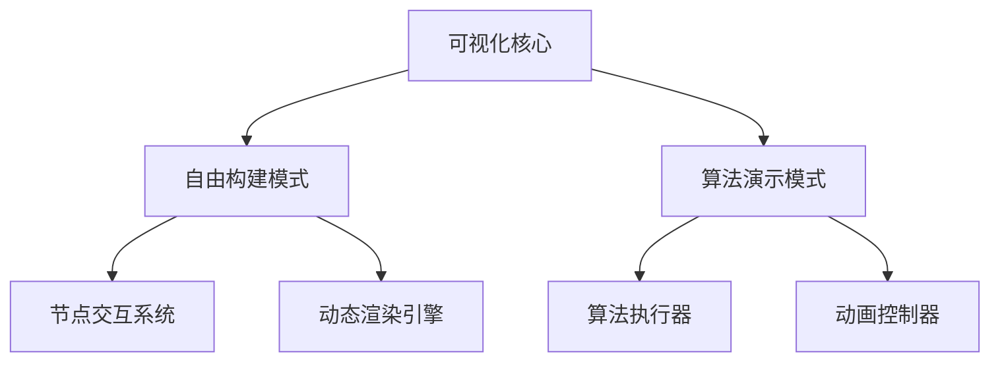
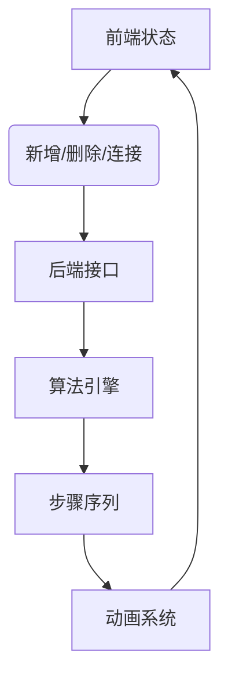
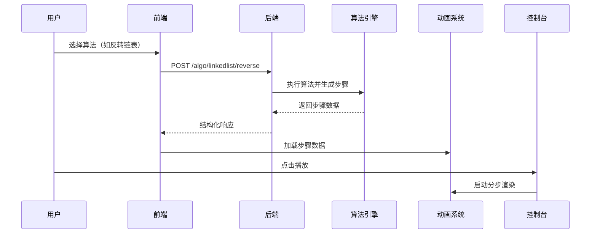
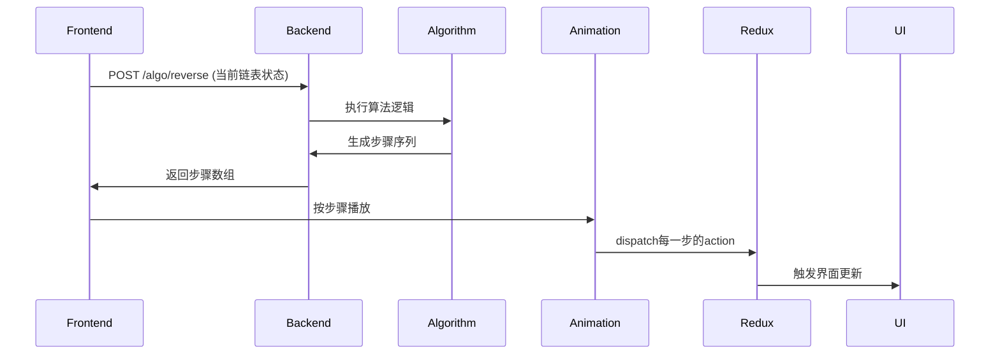
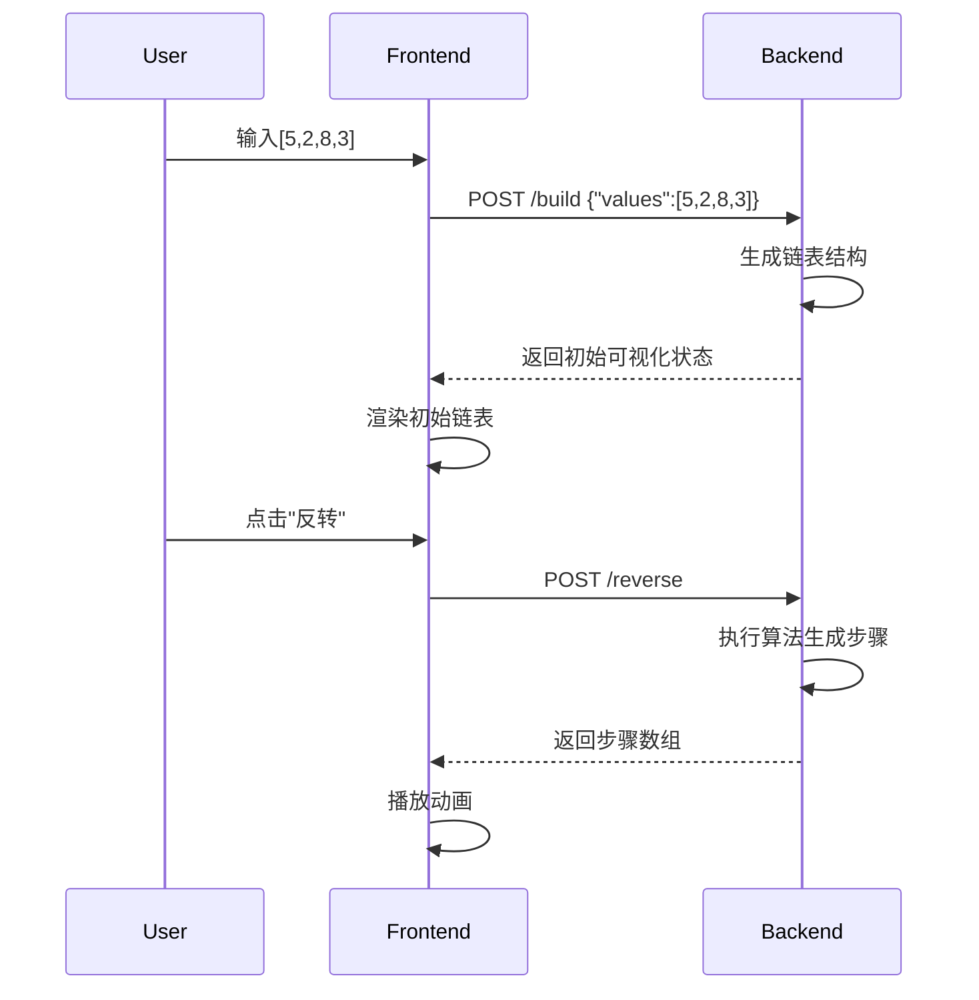
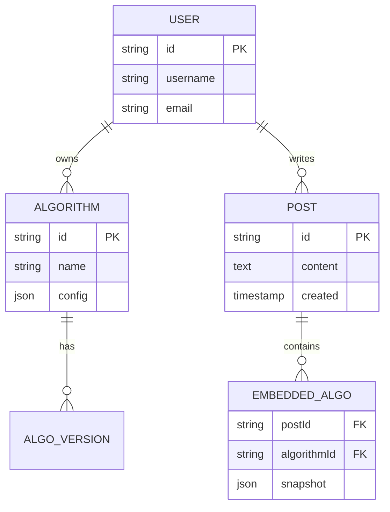

# 可视化设计

## 核心设计

- 可视化核心：提供自由构建模式和算法演示模式，支持用户通过拖拽节点和连接来构建可视化图形，并通过算法执行器来执行算法演示。



- 自由构建模式：

  ```TS
    // 链表节点数据模型
  interface LinkedListNode {
  id: string; // UUID
  value: number;
  nextId: string | null;
  position: { x: number; y: number };
  }
  // 全局状态管理（Redux）
  interface LinkedListState {
    nodes: Record<string, LinkedListNode>;
    headId: string | null;
    selectedNodeId: string | null;
  }
  ```





操作指令生命周期



动态输入处理流程：



ER:


