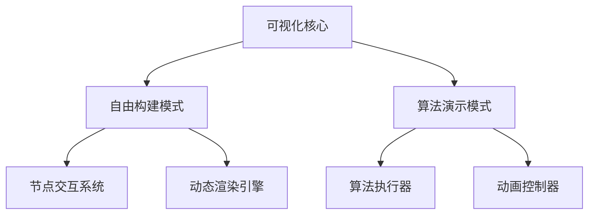
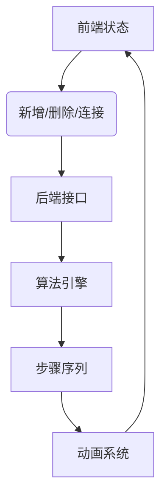

# 可视化设计

## 核心设计

- 可视化核心：提供自由构建模式和算法演示模式，支持用户通过拖拽节点和连接来构建可视化图形，并通过算法执行器来执行算法演示。

```mermaid
graph TD
    A[可视化核心] --> B[自由构建模式]
    A --> C[算法演示模式]
    B --> D[节点交互系统]
    B --> E[动态渲染引擎]
    C --> F[算法执行器]
    C --> G[动画控制器]
```

```mermaid
flowchart TD
    前端状态 --> 操作指令(新增/删除/连接)
    操作指令 --> 后端接口
    后端接口 --> 算法引擎
    算法引擎 --> 步骤序列
    步骤序列 --> 动画系统
    动画系统 --> 前端状态
```
